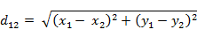
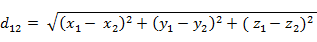
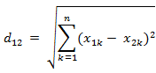
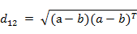
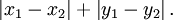
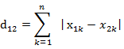

# LeetCode

#### 补充内容

**1. 原地算法（in-place algorithm）**

```text
In computer science, an in-place algorithm is an algorithm which transforms input using no auxiliary data structure. However a small amount of extra storage space is allowed for auxiliary variables. The input is usually overwritten by the output as the algorithm executes. In-place algorithm updates input sequence only through replacement or swapping of elements. An algorithm which is not in-place is sometimes called not-in-place or out-of-place. ————摘自维基百科（原地算法）
```

可总结为：
原地算法不依赖额外的资源或者依赖少数的额外资源，仅依靠输出来覆盖输入的一种算法操作。

```py
# 原地算法的 Python 实现
def reverse(a):
    """
    :param a: list
    :return: list
    """
    n = len(a)-1
    tmp = list()
    for i in range(int(n/2)):
        tmp = a[i]
        a[i] = a[n-i]
        a[n-i] = tmp
    print(a)

    return a

if __name__ == '__main__':
   a = [1, 2, 3, 4, 5, 6]
   reverse(a)

# 输出
-------------------------------
[6, 5, 3, 4, 2, 1]
```

**2. 曼哈顿距离算法（Manhattan Distance algorithm）**

曼哈顿距离（Manhattan Distance）：两点在南北方向上的距离加上在东西方向上的距离，即 d(i, j) = |xi - xj| + |yi - yj|。

【面试例题】
在 k-means 或 kNN，我们常用欧氏距离来计算最近的邻居之间的距离，有时也用曼哈顿距离，请对比下这两种距离的差别？
【解析】
欧氏距离，最常见的两点之间或多点之间的距离表示法，又称之为欧几里得度量，它定义于欧几里得空间中，如：
(1) 二维平面上两点 a(x1, y1)与 b(x2, y2)间的欧氏距离：

(2) 三维空间两点 a(x1, y1, z1)与 b(x2, y2, z2)间的欧氏距离：

(3) 两个 n 维向量 a(x11, x12, …, x1n)与 b(x21, x22, …, x2n)间的欧氏距离：

也可以用表示成向量运算的形式：


欧氏距离虽然很有用，但也有明显的缺点。它将样本的不同属性（即各指标或各变量量纲）之间的差别等同看待，这一点有时不能满足实际要求。例如，在教育研究中，经常遇到对人的分析和判别，个体的不同属性对于区分个体有着不同的重要性。因此，欧氏距离适用于向量各分量的度量标准统一的情况。

曼哈顿距离，我们可以定义曼哈顿距离的正式意义为 L1-距离或城市区块距离，也就是在欧几里得空间的固定直角坐标系上两点所形成的线段对轴产生的投影的距离总和。
(1) 二维平面两点 a(x1, y1)与 b(x2, y2)间的曼哈顿距离：

(2) 两个 n 维向量 a(x11, x12, …, x1n)与 b(x21, x22, …, x2n)间的曼哈顿距离：


曼哈顿距离依赖座标系统的转度，而非系统在坐标轴上的平移或映射。当坐标轴变动时，点间的距离就会不同。

曼哈顿距离和欧式距离一般用途不同，无相互替代性。

关于各种距离的比较，请参考：

- [从 K 近邻算法、距离度量谈到 KD 树、SIFT+BBF 算法](https://blog.csdn.net/v_july_v/article/details/8203674)
- [距离计算方法总结](https://www.cnblogs.com/soyo/p/6893551.html)
