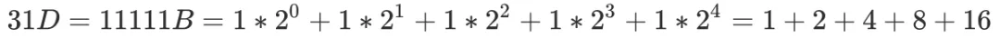

### 算法题中的数学基础

#### 一、基础运算

##### 1、位运算

在计算机的世界中，一切数字都是二进制的。类比于现实世界中我们所使用的十进制，二进制即为「逢二进一」的运算体系。

我们以 B、D 来分别标记二进制与十进制，例如 10D 表示十进制中的 10，而 10B 则表示二进制中的 10。

回顾十进制，

类比十进制，进一步理解二进制：

由此我们可以发现，十进制就是「逢十进一」，而二进制就是「逢二进一」。

在计算机的运算过程中，所有的数字都是用「二进制」表示的，其中数字的每一位称为一个 bit，其取值要么为 0，要么为 1。

「位运算」是「二进制」所特有的运算，共分为 6 类，如下表所示：


我们以 1011B、0101B 举例（均为无符号数）：

- 1011B & 0101B = 0001B
- 1011B | 0101B = 1111B
- 1011B ^ 0101B = 1110B
- ~1011B = 0100B
- 1011B << 2 = 101100B
- 1011B >> 2 = 10B

##### 2、快速幂

「快速幂」算法，常用于快速指数运算。
举个例子，如果想要计算  的具体数值，最少需要计算多少次可以完成？

一个比较显然的答案是从 1 开始连乘 31 个 2，这样肯定可以得到准确的答案，但是否有更快的方法？

答案显然是「有」，如果我们用二进制来表示 31，则可以得到：

由此我们可以将  进行转化，得到：

因此我们只需要求出 ，再将它们依次相乘，就可以得到 。

与此同时，，因此我们从 1 开始只需要计算 5 次即可求出 。再将这几个数字依次乘起来，就得到了 。

这种通过将指数转化为二进制，并以此来加快幂运算的方法就是快速幂。当计算 （a 为任意实数）时，快速幂方法可以将原来的 O(x) 时间复杂度降低为 O(log(x) )，从而大大加快指数运算。

下面用快速幂计算下  的值：

```js
// 计算 a ^ b
int poww (int a, int b) {
    int base = a, ans = 1;
    while (b) {
        if (b & 1) ans *= base;
        base *= base;
        b >>= 1;
    }
    return ans;
}
```
